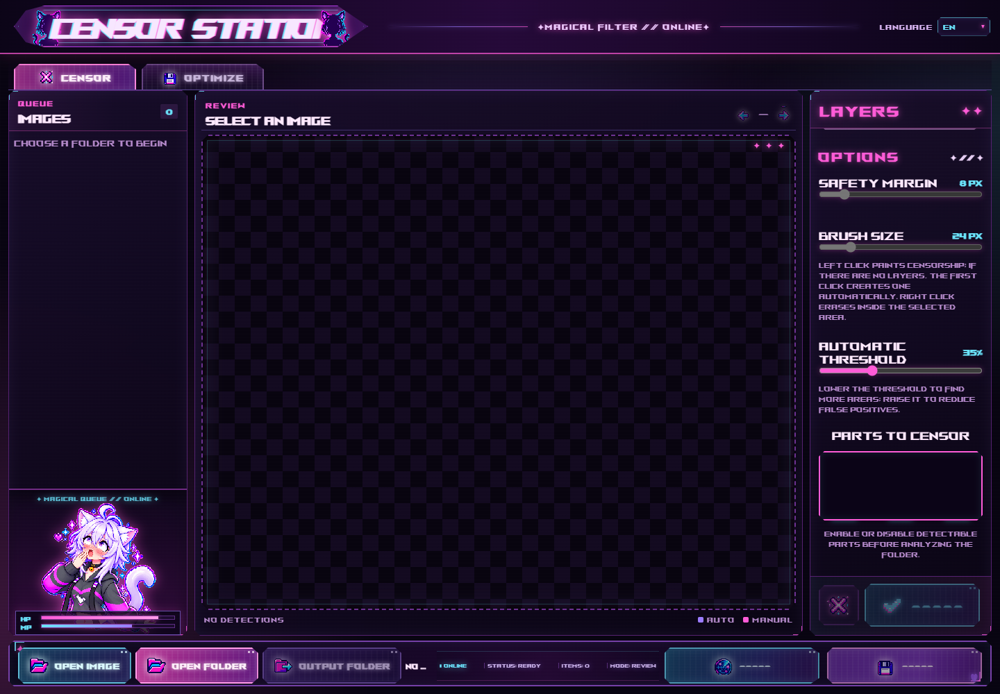

# Censor Station

Local desktop-style web app for reviewing images, detecting sensitive areas, applying censorship, and optimizing files without modifying the originals.



## Features

- Automatic and manual censorship.
- Pixelate, blur, black-line, and white-glow modes.
- Image-by-image review before saving.
- Local optimization with PNG, WebP, and JPEG.
- Spanish, English, Japanese, and Chinese interface.

## Requirements

- Node.js 20.19 or newer.
- Python 3.10 or newer for detection and optimization.
- `nsfw-anime-xl-x1280.pt` in `models/` for automatic detection.

## Run

On Windows:

```powershell
.\iniciar_autocensor.bat
```

Or from a terminal:

```powershell
npm install
npm start
```

Open `http://127.0.0.1:4173` in your browser.

## Privacy

Processing runs locally. Original images are never overwritten.
