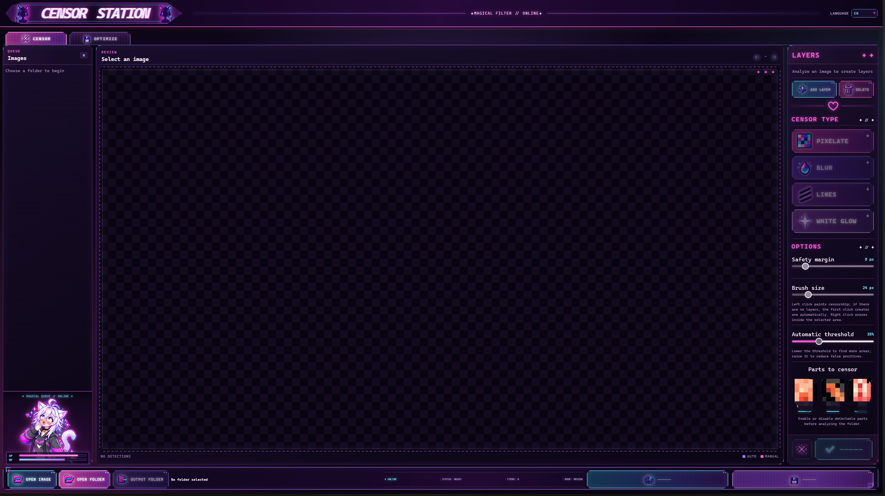

# Censor Station

Local desktop-style web app for reviewing images, detecting sensitive areas, applying censorship, and optimizing files without modifying the originals.



## Features

- Automatic and manual censorship.
- Desktop frame tracking: propagate a painted or detected layer forward,
  backward, or both ways through the same animation, with undo and cancellation.
- GIF support: every frame queues as an image; analysis fills detections and
  the final GIF keeps original timing, loop count, and untouched frames.
- Pixelate, blur, black-line, and white-glow modes.
- Image-by-image review before saving.
- Local optimization with PNG, WebP, and JPEG.
- Spanish, English, Japanese, and Chinese interface.

## Requirements

- Node.js 20.19 or newer.
- Python 3.10 or newer for detection and optimization.
- `nsfw-anime-xl-x1280.pt` in `models/` for automatic detection.

## Detection model

Automatic detection uses the `nsfw-anime-xl-x1280.pt` checkpoint published by [01miku on Hugging Face](https://huggingface.co/01miku/anime-nsfw-segm-yolo26). Download the [checkpoint file](https://huggingface.co/01miku/anime-nsfw-segm-yolo26/resolve/main/nsfw-anime-xl-x1280.pt) and place it in the `models/` directory.

Credit: 01miku. The local checkpoint matches the published file by SHA-256. The model card lists an MIT license, while the embedded Ultralytics checkpoint metadata lists AGPL-3.0; review the upstream terms before redistributing the weights.

## Run the desktop version

On Windows:

```powershell
.\start_censor_station.bat
```

Or from a terminal:

```powershell
npm install
npm start
```

Open `http://127.0.0.1:4173` in your browser.

## Web version

The same interface can run as a static web app. The browser detector uses the
ONNX export of the model with WebGPU when available and falls back to WebAssembly.
Image optimization also runs in the browser; when folder writing is unavailable,
multiple optimized files are downloaded as a ZIP.
Folder selection uses the File System Access API when available and a browser
file-list fallback otherwise. Browsers without folder write permissions use ZIP
downloads instead of modifying the originals.

On Windows, you can also double-click `start_censor_station_web.bat`. It installs
dependencies when needed, builds the web version, and keeps the preview server
open at `http://127.0.0.1:4174`.
For local development, export the model into `public/models/`:

```powershell
python -m pip install -r requirements-web-export.txt
python -m tools.python.export_web_model --output public/models
npm run build
```

The ONNX file is intentionally ignored because it is large. The default web
build loads the versioned export from the public [Hugging Face model repository](https://huggingface.co/negativemeta/censor-station-web-model).
You can override it with `VITE_WEB_MODEL_URL` during the Vite build to use a
same-origin copy or another CDN. The desktop version remains available as the
full local fallback for folder-based processing and Python-powered optimization.

To compare the browser-oriented export with the Python checkpoint on the
included test asset:

```powershell
python -m tools.python.validate_web_model
```

## Privacy

Processing runs locally. Original images are never overwritten.

## GIF censorship

### Desktop layer propagation

Select any animation frame, paint a missing area or select an existing layer,
then use **Frame tracking / Propagate layer** in the layers panel. Choose a frame
range and forward, backward, or both directions. **Follow motion** uses Python
OpenCV optical flow to translate, rotate, and scale the mask, including painted
and erased brush strokes. **Fixed position** copies the same area unchanged.

The source frame stays unchanged and existing layers in other frames are kept.
Updated frames return to pending review. Tracking stops independently in each
direction when matches become unreliable and marks the first failed frame in
the queue. Correct that frame and propagate again over the remaining range.
**Undo propagation** removes the layers added by the latest run for that animation;
other layers stay intact. Cancellation keeps completed additions, which can be
reviewed or undone. Re-running adds layers; undo a previous run if replacing it.

Install Python dependencies with `python -m pip install -r requirements.txt`.
This feature requires the desktop server and is hidden in the standalone web
version. Optical flow works best on small movements with visible texture;
occlusions and abrupt pose changes require manual corrections.

GIFs are expanded into full-canvas frames on load; every frame queues as a
pending image (labeled `name · f3` with a `GIF 3/24` status) and the Analyze
buttons fill in detections like still images. Approve the frames you want
censored and the app reassembles the animation with the original per-frame
delays, loop count, and untouched frames preserved. GIFs are capped at 300
frames per file.

- Desktop: extraction runs on the server with Pillow. Assembly uses the
  `gifski` CLI binary (AGPL-3.0+, https://gif.ski) when it is installed and
  the frame delays are uniform (`--fps` only supports one rate), otherwise
  Pillow preserves the exact timing. Install it with `brew install gifski`,
  `cargo install gifski`, or your system package manager.
- Web: decoding uses `gifuct-js` and encoding uses `gifenc` (both MIT, pure
  JS, bundled with the app). When the desktop server is reachable it is
  preferred for extraction and assembly; otherwise the browser pipeline
  takes over automatically.
